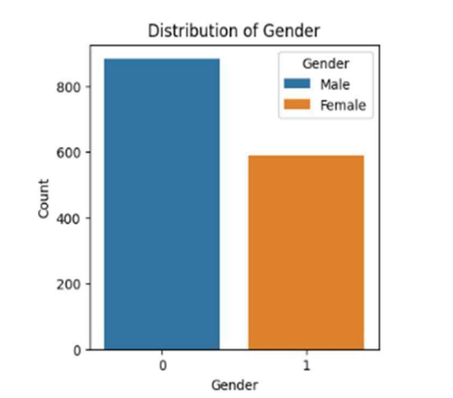
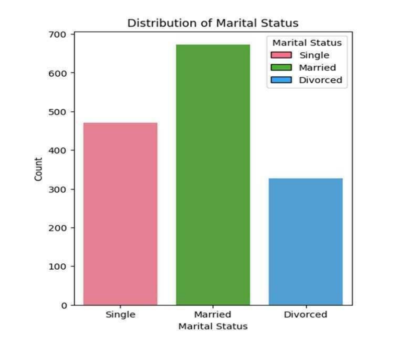
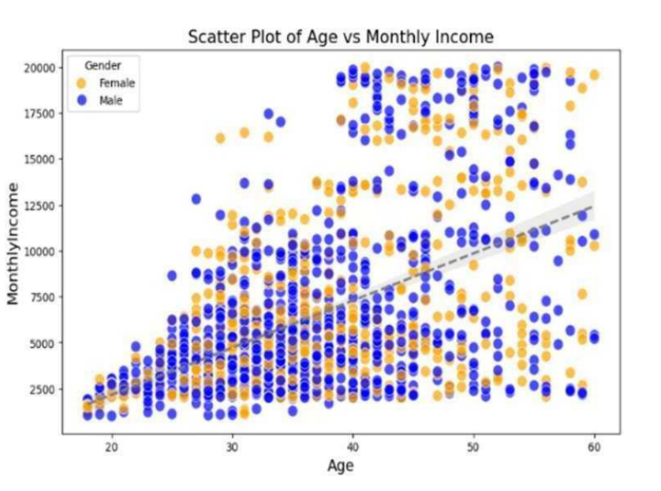
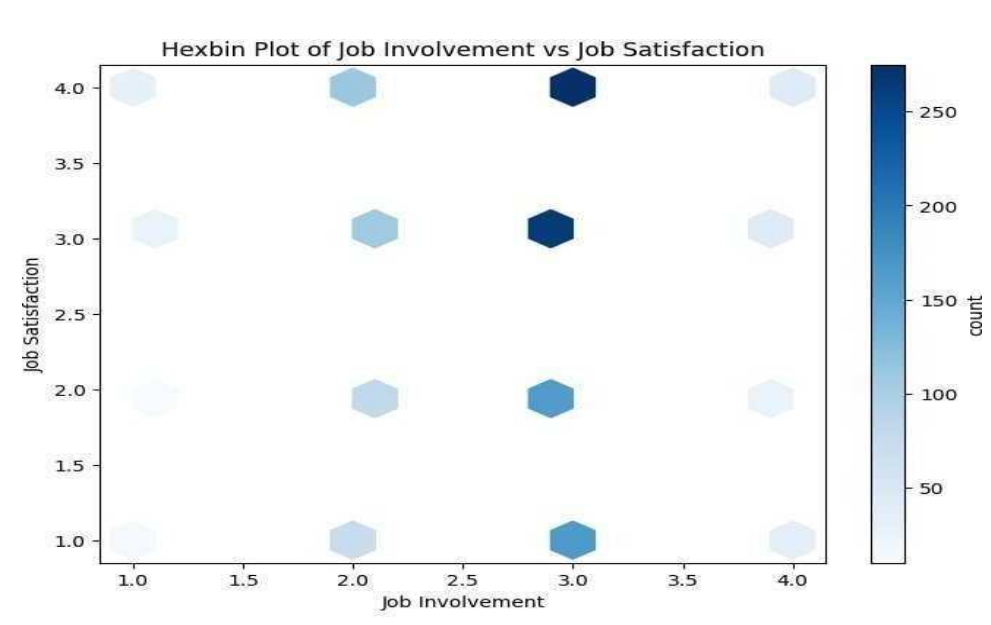
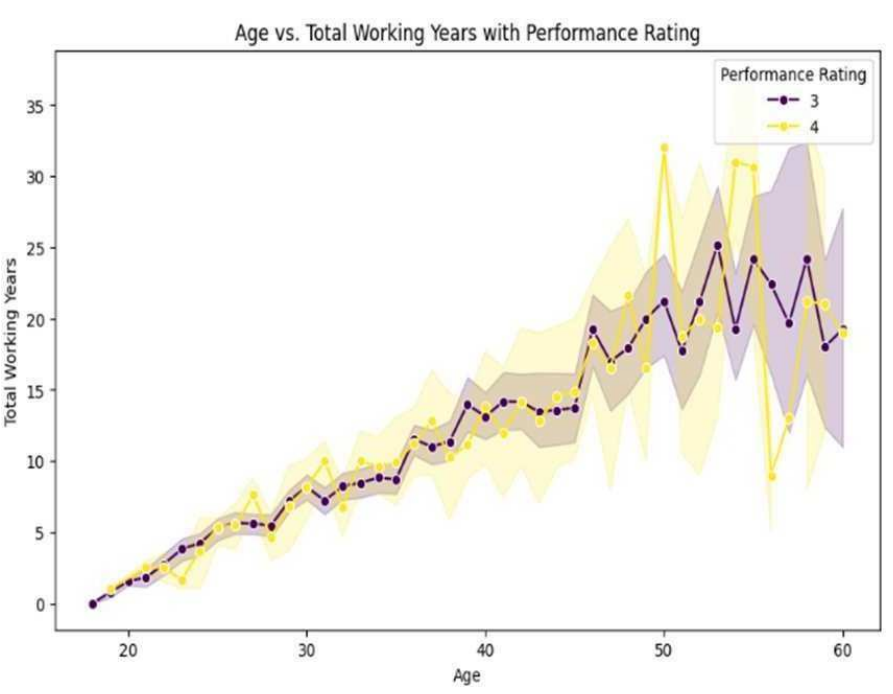

### Key Visualizations

#### Gender Distribution

- Workforce shows higher representation of male employees

#### Marital Status Distribution

- Majority of employees are married, followed by single employees

#### Age vs Income

- Income generally increases with age
- Significant variation exists within the same age group

#### Job Involvement vs Satisfaction

- Higher job involvement is associated with higher job satisfaction
- Most employees fall in moderate to high levels

#### Age vs Performance (with Experience)

- Performance tends to improve with experience and age
- Higher-rated employees show greater variability in experience
